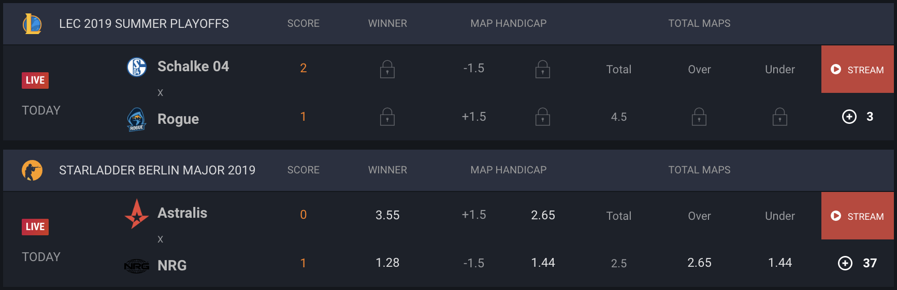

# bookie-odds-scraper
Game odds scraper from bookie websites

## Example Table for Odds Data

## Description

This project contains code to scrape odds data from bookie websites like ggbet, egb and others. In particular we scrape CSGO odds data like teams, tournaments and winner odds.

Since each website has different formatting, the data manipulation for each scraper must be hard coded to the website. Exploratory code for each website can be found in the `notebooks` directory.

The very basic procedure of each scraper is the following:

1. Fetch website html text using Selenium.
2. Locate and extract the relevant section containing tabular data.
3. Transcribe the html tabular data into python data structures.
4. Write the cleaned data to a database.

These scrapers are containerized using Docker and run on a schedule with AWS Fargate. The containers access database credentials and a Sentry URL for monitoring via environment variables configured on each deployment. The container images can be found on [Docker Hub](https://hub.docker.com/u/maxlamberti).

## Tech

- Selenium
- PostgreSQL
- Docker
- AWS Fargate
- Sentry
